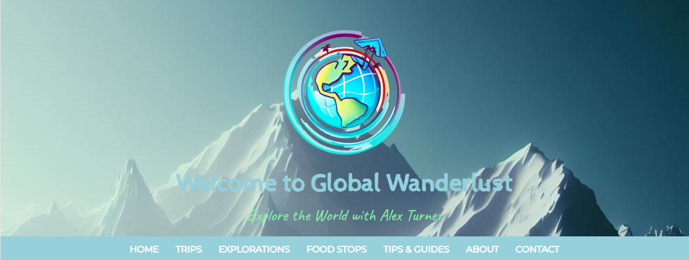

# Global Wanderlust - A Simple Website I Created to Learn HTML and CSS and Develop that Skills 🌍

[](https://opensource.org/licenses/MIT)



## Overview

Global Wanderlust is a simple mock travel blog website created to develop my basic web development skills using HTML and CSS.

## Features

- Basic website built with HTML and CSS 🖌️
- Minimalist and user-friendly design 🚀
- Pages displaying travel articles 📖

  :warning: **Warning:** Content of the posts in this website was generated through ChatGPT. It may contain wrong information.

## Installation

Clone the repository and open the `index.html` file in your web browser.

```bash
git clone https://github.com/init-rnts/global_wanderlust.git
cd global-wanderlust
```

## Contributing

Contributions are welcome! If you find a bug or want to add a new feature, feel free to open an issue or submit a pull request.

## License

This project is licensed under the MIT License - see the [LICENSE](LICENSE) file for details.
